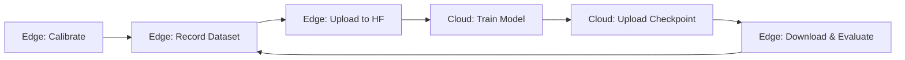

# SO101 ARM Workflow Scripts - Architecture Plan

## Overview

This directory contains automated scripts for operating the SO101 ARM robot, from calibration through dataset recording to training preparation. The scripts are designed to streamline the workflow described in [`so101_example.md`](../so101_example.md).

## Directory Structure

```
so101_scripts/
├── PLAN.md                          # This file - architecture and design
├── README.md                        # User guide and quick start
├── .env.example                     # Template for environment variables
├── config/
│   ├── camera_config.sh            # Camera device mappings
│   ├── robot_config.sh             # Robot port and ID configurations
│   └── dataset_config.sh           # Dataset recording parameters
├── scripts/
│   ├── 00_verify_setup.sh          # Verify environment and hardware
│   ├── 01_set_permissions.sh       # Set USB port permissions
│   ├── 02_calibrate_follower.sh    # Calibrate follower arm
│   ├── 03_calibrate_leader.sh      # Calibrate leader arm
│   ├── 04_test_teleoperate.sh      # Test teleoperation without cameras
│   ├── 05_test_cameras.sh          # Test camera feeds with ffplay
│   ├── 06_teleoperate_with_cameras.sh  # Full teleoperation with cameras
│   ├── 07_record_dataset.sh        # Record training dataset
│   ├── 08_upload_dataset.sh        # Upload dataset to HuggingFace
│   └── 09_prepare_training.sh      # Prepare for cloud training
├── utils/
│   ├── check_devices.sh            # Check robot and camera connections
│   ├── activate_env.sh             # Helper to activate conda environment
│   └── hf_login.sh                 # HuggingFace authentication helper
├── logs/                           # Execution logs
│   └── .gitkeep
└── datasets/                       # Local dataset storage
    └── .gitkeep
```

## Camera Configuration

Based on user's hardware setup:

| Device | Purpose | Index for LeRobot |
|--------|---------|-------------------|
| `/dev/video0` | Laptop camera | Not used |
| `/dev/video2` | Laptop IR/LiDAR | Not used |
| `/dev/video4` | Arm-mounted camera | 4 (optional) |
| `/dev/video6` | Side view camera | 6 (side) |
| `/dev/video8` | Overhead camera | 8 (top) |

**LeRobot Configuration:**
- `top` camera: `index_or_path: 8` (overhead view)
- `side` camera: `index_or_path: 6` (side view)

## Robot Configuration

Default configuration (user should verify):

| Component | Device | ID |
|-----------|--------|-----|
| Leader ARM | `/dev/ttyACM0` | `my_awesome_leader_arm` |
| Follower ARM | `/dev/ttyACM1` | `my_awesome_follower_arm` |

## Environment Variables

The `.env` file will store:

```bash
# HuggingFace Configuration
HF_TOKEN=your_huggingface_token_here
HF_USER=your_huggingface_username

# Weights & Biases (optional)
WANDB_TOKEN=your_wandb_token_here

# Dataset Configuration
DATASET_NAME=so101_dataset
DATASET_TASK="pickup the cube and place it to the bin"
DATASET_NUM_EPISODES=60
DATASET_EPISODE_TIME=20
DATASET_RESET_TIME=10

# Robot Configuration
LEADER_PORT=/dev/ttyACM0
FOLLOWER_PORT=/dev/ttyACM1
LEADER_ID=my_awesome_leader_arm
FOLLOWER_ID=my_awesome_follower_arm

# Camera Configuration
TOP_CAMERA_INDEX=8
SIDE_CAMERA_INDEX=6
CAMERA_WIDTH=640
CAMERA_HEIGHT=480
CAMERA_FPS=30

# Local Storage
DATASET_ROOT=${HOME}/so101_datasets
```

## Workflow Sequence

### Phase 1: Setup & Verification (One-time)
1. **Verify Setup** (`00_verify_setup.sh`)
   - Check conda environment is activated
   - Verify LeRobot installation
   - Check robot connections
   - Verify camera availability

2. **Set Permissions** (`01_set_permissions.sh`)
   - Grant USB port access for robot arms
   - Run: `sudo chmod 666 /dev/ttyACM*`

### Phase 2: Calibration (One-time per robot)
3. **Calibrate Follower** (`02_calibrate_follower.sh`)
   - Interactive calibration process
   - Saves calibration data

4. **Calibrate Leader** (`03_calibrate_leader.sh`)
   - Interactive calibration process
   - Saves calibration data

### Phase 3: Testing
5. **Test Teleoperation** (`04_test_teleoperate.sh`)
   - Test basic arm control without cameras
   - Verify leader-follower synchronization

6. **Test Cameras** (`05_test_cameras.sh`)
   - Preview each camera feed using ffplay
   - Verify camera angles and positioning

7. **Teleoperate with Cameras** (`06_teleoperate_with_cameras.sh`)
   - Full system test with visual feedback
   - Verify camera integration

### Phase 4: Data Collection
8. **Record Dataset** (`07_record_dataset.sh`)
   - Record teleoperation episodes
   - Save locally and optionally to HuggingFace
   - Configurable number of episodes and duration

9. **Upload Dataset** (`08_upload_dataset.sh`)
   - Upload completed dataset to HuggingFace Hub
   - Verify upload success

### Phase 5: Training Preparation
10. **Prepare for Training** (`09_prepare_training.sh`)
    - Generate training command templates
    - Create cloud training notebook
    - Document dataset location and configuration

## Script Features

### Common Features Across All Scripts
- ✅ Automatic conda environment activation
- ✅ Environment variable loading from `.env`
- ✅ Comprehensive error handling
- ✅ Detailed logging to `logs/` directory
- ✅ Color-coded console output
- ✅ Progress indicators
- ✅ Idempotent (safe to re-run)

### Safety Features
- Pre-flight checks before operations
- Confirmation prompts for destructive actions
- Automatic backup of calibration data
- Resume capability for interrupted recordings

## Integration with Training

### Local to Cloud Workflow



### Dataset Format for Training

Datasets will be compatible with:
- **ACT (Action Chunking Transformer)** - Default policy
- **VLA (Vision-Language-Action)** models
- **SmolVLA** - Smaller VLA variant
- **Pi** - Diffusion policy

### Training Configuration

The scripts will generate training commands for:

```bash
# ACT Training (default)
lerobot-train \
  --dataset.repo_id=${HF_USER}/${DATASET_NAME} \
  --policy.type=act \
  --batch_size=64 \
  --steps=10000 \
  --output_dir=outputs/train/act_${DATASET_NAME} \
  --job_name=act_${DATASET_NAME} \
  --policy.device=cuda \
  --wandb.enable=true

# VLA Training (requires additional setup)
lerobot-train \
  --dataset.repo_id=${HF_USER}/${DATASET_NAME} \
  --policy.type=smolvla \
  --batch_size=32 \
  --steps=10000 \
  --output_dir=outputs/train/smolvla_${DATASET_NAME} \
  --job_name=smolvla_${DATASET_NAME} \
  --policy.device=cuda \
  --wandb.enable=true
```

## Error Handling & Recovery

### Common Issues and Solutions

1. **"command not found" errors**
   - Solution: Ensure conda environment is activated
   - Script: `utils/activate_env.sh`

2. **USB permission denied**
   - Solution: Run `01_set_permissions.sh`
   - May need to re-run after system reboot

3. **Camera not detected**
   - Solution: Check physical connections
   - Use `utils/check_devices.sh` to diagnose

4. **Calibration data lost**
   - Solution: Automatic backups in `~/.cache/lerobot/`
   - Re-run calibration scripts if needed

5. **Dataset recording interrupted**
   - Solution: Use `--resume=true` flag
   - Script handles resume automatically

## Security Considerations

### Credential Management
- `.env` file is gitignored
- Never commit tokens to version control
- Use `.env.example` as template
- Tokens stored locally only

### HuggingFace Token Permissions
Required scopes:
- `read` - Download datasets
- `write` - Upload datasets and models

## Performance Optimization

### Dataset Recording
- Recommended episode length: 15-30 seconds
- Reset time: 10-15 seconds (adjust based on task)
- Number of episodes: 50-100 for initial training

### Camera Settings
- Resolution: 640x480 (balance quality/performance)
- FPS: 30 (smooth motion capture)
- Format: YUYV (compatible with most cameras)

## Future Enhancements

Potential additions:
- [ ] Automatic dataset quality checks
- [ ] Multi-task dataset recording
- [ ] Real-time training metrics dashboard
- [ ] Automated model evaluation scripts
- [ ] Dataset augmentation tools
- [ ] Batch processing for multiple recordings

## References

- [LeRobot Documentation](https://huggingface.co/docs/lerobot/index)
- [SO101 Tutorial](https://huggingface.co/docs/lerobot/so101)
- [QuickStart Guide](../QuickStart.md)
- [SO101 Example Commands](../so101_example.md)
- [Training on ROCm](../training-models-on-rocm.ipynb)

## Support

For issues or questions:
1. Check the logs in `logs/` directory
2. Review the README.md in this directory
3. Consult the SO101 example documentation
4. Check LeRobot GitHub issues

---

**Status:** Architecture Complete - Ready for Implementation
**Last Updated:** 2025-12-07
**Version:** 1.0